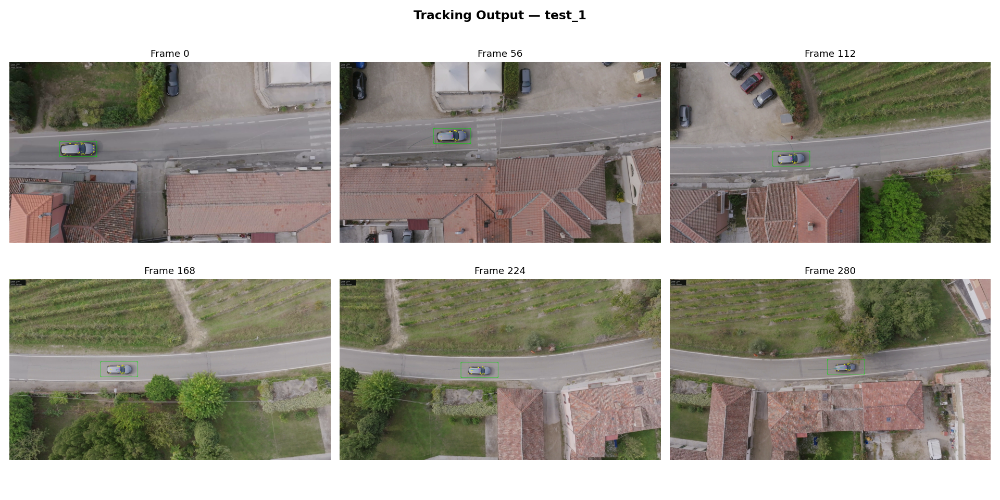
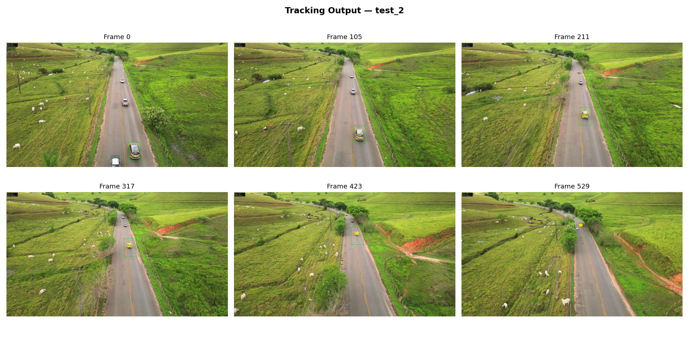
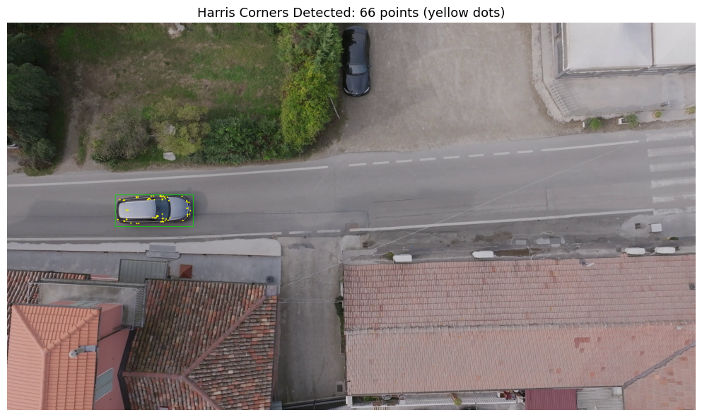
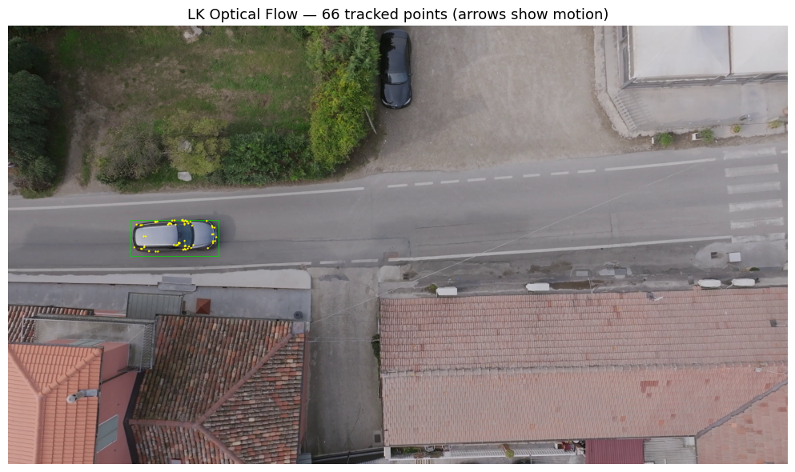
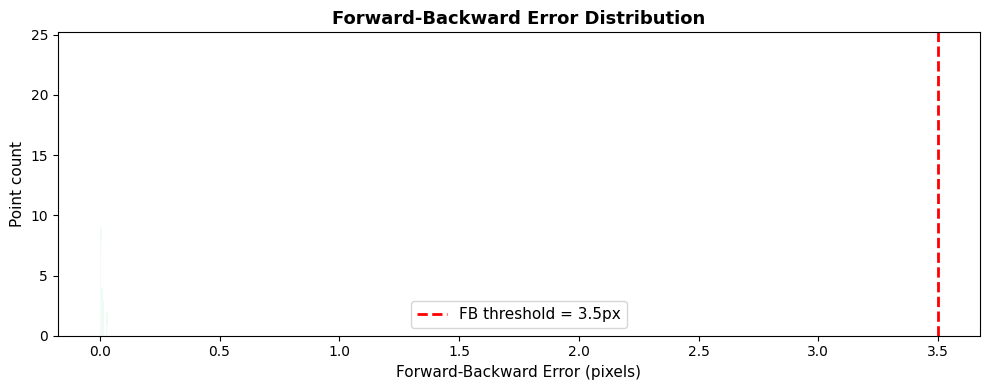
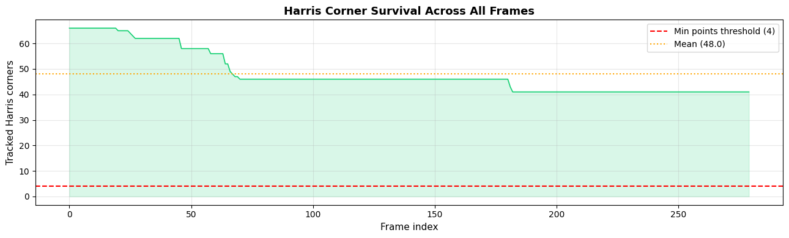
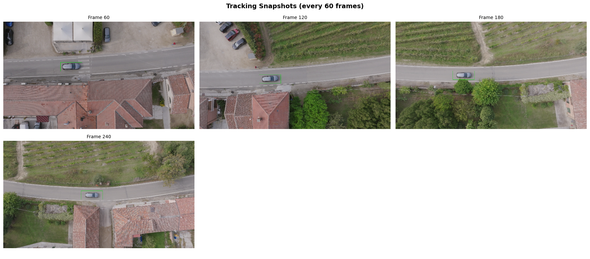
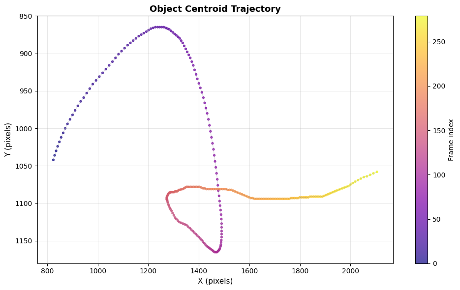

# Harris–LK Vehicle Tracker

> Classical single-object vehicle tracking using Harris Corner Detection and pyramidal Lucas–Kanade Optical Flow — no deep learning, no Kalman filter.

[](https://www.python.org/)
[](https://opencv.org/)
[](https://numpy.org/)
[](LICENSE)
[](https://www.microsoft.com/windows)
[]()
[]()

---

## Overview

This project implements a complete, interpretable single-object tracker built entirely on classical computer vision primitives. Given a user-defined bounding box on a start frame, the system detects Harris corners inside the box and tracks them across subsequent frames using pyramidal LK optical flow — updating the bounding box each frame via the median displacement of surviving feature points.

The design deliberately avoids deep learning and Kalman filtering to demonstrate that well-engineered classical methods can achieve robust, stable tracking on high-resolution 4K footage when the right fallback mechanisms are in place.

**Validated on two 4K test sequences — 100% tracker stability on both, across 280 and 529 frames respectively. Zero manual interventions. Zero restarts.**

---

## Table of Contents

- [Demo](#demo)
- [How It Works](#how-it-works)
- [Key Engineering Decisions](#key-engineering-decisions)
- [Project Structure](#project-structure)
- [Installation](#installation)
- [Usage](#usage)
- [Configuration Reference](#configuration-reference)
- [Results](#results)
- [Tested Environment](#tested-environment)
- [Troubleshooting](#troubleshooting)
- [Known Limitations](#known-limitations)
- [Academic Context](#academic-context)
- [Citation](#citation)
- [License](#license)

---

## Demo

> The `results/` directory is excluded from this repository due to large file sizes. All images below are generated automatically when you run the pipeline. Paths are valid after your first run.

---

### Test 1 — Top-Down Drone Footage (4K · 24 fps · 280 frames)

Tracking a silver car on a road viewed directly from overhead. The uniform car roof produces sparse features (~66 corners at initialisation) competing with strong stationary road-marking corners. The velocity-guided background filter suppresses road noise and holds tracking stable across the full sequence.



---

### Test 2 — Oblique Drone Surveillance (4K · 30 fps · 529 frames)

Tracking a vehicle across a rural road from an oblique angle. The perspective exposes the car's side panels, windows, and wheel arches — yielding 201 stable corner points that remain constant throughout all 529 frames without a single redetection event.



---

### Harris Corner Detection at Initialisation

66 Harris corners detected inside the manually drawn bounding box on frame 0. Points cluster on the car's structural edges, roof panel boundaries, and window frames — exactly where second-order gradient information is richest.



---

### LK Optical Flow — Frame-to-Frame Tracking

All 66 corners tracked successfully on the first inter-frame pass. Yellow dots show tracked feature locations; the green bounding box is updated via the median displacement vector of all surviving points.



---

### Forward-Backward Error Distribution

Distribution of round-trip errors across all tracked points on a representative frame. Nearly all points cluster at ~0 px — well below the 3.5 px rejection threshold (red dashed line). Only points exceeding this threshold are discarded before the displacement median is computed.



---

### Harris Corner Survival — Test 1 (280 frames)

Point count across the full 280-frame sequence. The tracker never drops below the 4-point minimum threshold (red dashed line). Mean: 48.0 corners/frame. Stepped drops correspond to forward-backward filtering events; redetection fires at the 25% survival threshold when needed.



---

### Periodic Tracking Snapshots — Test 1

Bounding box overlaid on the vehicle at every 60-frame interval across the full sequence. The box remains tightly aligned with the car through straight road sections, a right-angle intersection turn, and continued travel.



---

### Object Centroid Trajectory — Test 1

Full centroid path across 280 frames, colour-mapped by frame index (purple → yellow). The trajectory accurately traces the car's actual route: straight road section, right-angle turn at intersection, continued travel on the new road.



---

## How It Works

The tracker runs a strict 6-step pipeline per frame:

| Step | Operation | Detail |
|------|-----------|--------|
| 1 | **Read frame** | Decode next frame from video source |
| 2 | **Detect Harris corners** | Run inside bounding box on start frame (or on redetection trigger) |
| 3 | **Forward LK pass** | Track all active points from previous frame to current frame |
| 4 | **Backward LK pass** | Track those same points back from current frame to previous frame |
| 5 | **Forward-backward filter** | Reject any point whose round-trip pixel error exceeds 3.5 px |
| 6 | **Update bounding box** | Shift bbox by the median displacement of all surviving points |

This loop repeats for every frame until the sequence ends, the user presses `Q`, or the tracker deactivates after 45 consecutive zero-point frames (~1.5 s at 30 fps).

---

## Key Engineering Decisions

These are the mechanisms that make the difference between a tracker that works on clean test cases and one that holds up on real 4K footage across 500+ frames.

### 1. Velocity-Guided Background Filter

**Problem:** A fast-moving vehicle shares the frame with many stationary Harris corners on road markings, pavement texture, and kerbs. These produce near-zero optical flow and contaminate the median displacement estimate, causing the bbox to drift toward the background.

**Solution:** When estimated object speed exceeds 3 px/frame, any tracked point whose displacement magnitude falls below 30% of the current velocity estimate is classified as stationary background and discarded before the median is computed.

**Result:** Background corner contamination is eliminated without any per-video threshold tuning.

---

### 2. Survival-Based Redetection

**Problem:** Scheduled redetection on a fixed interval wastes computation when the point cloud is healthy and fires too late when points degrade suddenly due to texture change or partial occlusion.

**Solution:** Redetection triggers only when surviving point count falls below 25% of the initial count detected at frame 0. Harris corners are re-detected inside the current bounding box estimate, replenishing the feature pool exactly when needed.

**Result:** The tracker adapts to texture changes and partial occlusion without a fixed schedule — and never fires at all when unnecessary (as in Test 2, where no redetection triggered across all 529 frames).

---

### 3. Velocity Prediction Fallback

**Problem:** When a vehicle exits the frame or passes through a brief full occlusion, surviving point count can drop to zero. Without a fallback, the bbox freezes at its last known position.

**Solution:** An exponentially smoothed velocity estimate is maintained every frame from tracked point displacements. When active point count drops critically low, bbox position is updated by blending the velocity estimate with the measured displacement. When zero points survive, pure velocity extrapolation holds the bbox on-target for up to 45 frames.

**Result:** The tracker follows the vehicle to the frame boundary rather than stalling at the last observed position — critical for exit-phase sequences like Test 2.

---

### 4. CLAHE Preprocessing

**Problem:** 4K drone footage frequently has uneven illumination — shadows, sun glare, and exposure variation. This degrades Harris detection in dark regions and LK convergence in overexposed areas.

**Solution:** Contrast Limited Adaptive Histogram Equalisation (CLAHE) is applied to the grayscale frame before both Harris detection and LK tracking. Parameters: clip limit 3.5, tile grid 4×4.

**Result:** Corner detection and flow estimation are more uniform across lighting conditions without globally amplifying sensor noise.

---

## Project Structure

```
harris-lk-vehicle-tracker/
│
├── core/
│   ├── harris_detector.py        # Harris corner detection with CLAHE preprocessing and bbox mask
│   ├── lucas_kanade.py           # Pyramidal LK with forward-backward error filtering
│   └── object_tracker.py         # Stateful tracker: velocity prediction, redetection, bbox update
│
├── utils/
│   ├── config_loader.py          # YAML config loader with dot-access attribute interface
│   ├── folder_manager.py         # Timestamped output directory manager (runs never overwrite)
│   ├── health_check.py           # Pre-flight environment and dependency validation
│   └── resolution_utils.py       # Frame resolution helpers
│
├── metrics/
│   ├── logger.py                 # Levelled logging — INFO / DEBUG / WARNING
│   └── performance_tracker.py    # Per-frame metric accumulation and JSON export
│
├── visualization/
│   ├── display.py                # Bounding box, centroid trail, and corner overlay rendering
│   └── plotter.py                # Result plot generation (Harris response, trajectory, survival)
│
├── video_io/
│   ├── output_writer.py          # OpenCV VideoWriter wrapper (H.264 MP4)
│   └── video_source.py           # Video source with buffering
│
├── notebooks/
│   ├── phase1_infrastructure.ipynb   # Config loading, logging, folder management
│   ├── phase2_algorithms.ipynb       # Harris detection + interactive bbox selection via cv2.selectROI
│   ├── phase3_tracking.ipynb         # LK optical flow + forward-backward filtering
│   ├── phase4_results.ipynb          # Evaluation metrics, plots, analysis
│   └── phase5_integration.ipynb      # Full end-to-end pipeline — primary entry point
│
├── video/                       # Place test videos here — excluded from repo (.gitignore)
│   └── test_1 and test_2         # Placeholder describing the original test sequences
│
├── results/                      # Auto-generated on every run — excluded from repo (.gitignore)
│
├── report/
│   └── cv_project_tracking_report.pdf
│
├── main.py                       # CLI entry point
├── config.yaml                   # All tunable parameters
├── requirements.txt
├── CONTRIBUTING.md
└── LICENSE
```

---

## Installation

### Prerequisites

- Python 3.12
- Windows 11 (primary supported platform — see [Troubleshooting](#troubleshooting) for Linux/macOS notes)
- Jupyter Notebook or JupyterLab

### Steps

**1. Clone the repository**

```bash
git clone https://github.com/whozahm3d/harris-lk-vehicle-tracker.git
cd harris-lk-vehicle-tracker
```

**2. Create and activate a virtual environment**

```bash
python -m venv venv

# Windows
venv\Scripts\activate

# macOS / Linux
source venv/bin/activate
```

**3. Install dependencies**

```bash
pip install -r requirements.txt
```

**4. Download the OpenH264 DLL (Windows only)**

Required for H.264 MP4 output via OpenCV on Windows. Download `openh264-1.8.0-win64.dll` from the [Cisco OpenH264 releases page](https://github.com/cisco/openh264/releases) and place it in the **project root** alongside `main.py`.

> If the DLL is already present in the project root after cloning, skip this step.

**5. Add your test video**

Place your video file inside the `videos/` folder. The folder already exists in the repository with a placeholder file (`test_1 and test_2`) describing the original test sequences. The actual video files are excluded due to size.

```
videos/
└── your_video.mp4
```

To reproduce the original results, use any 4K vehicle footage and set the correct `source`, `start_frame`, and `bbox` in `config.yaml`.

---

## Usage

### Step 1 — Configure `config.yaml`

Only three fields change between videos. Everything else uses the defaults.

```yaml
input:
  source: "C:\\path\\to\\your\\videos\\test_1.mp4"   # Full path to your video file
  start_frame: 0                                       # Frame index to begin tracking from
  bbox: [x, y, width, height]                          # Bounding box in full-resolution pixels
```

> **Windows path note:** Use double backslashes (`\\`) or forward slashes (`/`). Single backslashes will fail silently.

### Step 2 — Select your start frame and draw the bounding box

Open and run `notebooks/phase2_algorithms.ipynb`. It will:

- Open a frame scrubber to navigate the video and select the exact start frame
- Launch `cv2.selectROI` to draw a bounding box around the target vehicle
- Print the exact `start_frame` and `bbox` values to paste into `config.yaml`

### Step 3 — Run the full tracking pipeline

Open and run `notebooks/phase5_integration.ipynb`. It will:

- Load config, initialise the tracker on the selected frame, and process all subsequent frames
- Display a live 1280×720 preview window during tracking (press `Q` to stop early)
- Save the annotated output video, logs, metrics, parameter snapshot, and all diagnostic plots to a timestamped folder under `results/`

### CLI Alternative

```bash
python main.py --config config.yaml
```

### Output Structure

Each run produces a self-contained, timestamped folder. Successive runs never overwrite each other.

```
results/
└── test_1_20260516_173936/
    ├── videos/
    │   └── test_1_tracked.mp4              # Annotated H.264 output video
    ├── logs/
    │   └── run.log                         # Full run log with per-frame point counts
    ├── plots/
    │   ├── integration_snapshots.png       # 6-panel tracking summary across the sequence
    │   ├── phase_2/
    │   │   ├── first_frame.png
    │   │   ├── harris_corners.png
    │   │   ├── harris_response.png
    │   │   └── quality_level_comparison.png
    │   ├── phase_3/
    │   │   ├── lk_tracking.png
    │   │   ├── fb_error_distribution.png
    │   │   └── bbox_update.png
    │   └── phase_4/
    │       ├── centroid_trajectory.png
    │       ├── point_survival.png
    │       ├── snapshots.png
    │       └── tracking_summary.txt        # Human-readable performance summary
    ├── metrics/
    │   └── test_1_metrics.json             # Avg / min / max points, total frame count
    └── params/
        └── test_1_params.json              # Full config snapshot for reproducibility
```

---

## Configuration Reference

<details>
<summary>Click to expand full parameter reference</summary>

| Parameter | Default | Description |
|-----------|---------|-------------|
| **Input** | | |
| `input.source` | `""` | Full path to the input video file |
| `input.start_frame` | `0` | Frame index to begin tracking from |
| `input.bbox` | `[x, y, w, h]` | Bounding box in full-resolution pixels — set via Phase 2 notebook |
| **Harris Corner Detection** | | |
| `harris.max_corners` | `400` | Maximum corners to detect inside the bounding box |
| `harris.quality_level` | `0.005` | Minimum corner quality relative to the strongest corner — lower yields more points |
| `harris.min_distance` | `3` | Minimum pixel distance between detected corners |
| `harris.block_size` | `5` | Neighbourhood size for computing the corner response matrix |
| `harris.k` | `0.04` | Harris sensitivity constant — standard value, rarely needs tuning |
| `harris.redetect_threshold` | `0.25` | Survival ratio below which redetection fires — 0.25 means below 25% of initial count |
| **Lucas–Kanade Optical Flow** | | |
| `lucas_kanade.win_size` | `[41, 41]` | Search window size — larger handles faster inter-frame motion |
| `lucas_kanade.max_level` | `5` | Pyramid levels — higher handles larger displacements per frame |
| `lucas_kanade.max_iter` | `30` | Maximum LK iterations per point per pyramid level |
| `lucas_kanade.epsilon` | `0.01` | LK convergence criterion |
| `lucas_kanade.min_eig_threshold` | `0.001` | Minimum eigenvalue threshold — discards poorly textured patches |
| `lucas_kanade.fb_error_threshold` | `3.5` | Forward-backward round-trip rejection threshold in pixels |
| **Tracking Logic** | | |
| `tracking.min_points_per_object` | `4` | Minimum surviving points for a valid median displacement estimate |
| `tracking.bbox_smoothing` | `0.0` | Temporal smoothing on bbox updates — 0.0 snaps exactly to median |
| `tracking.redetect_interval` | `60` | Scheduled redetection interval — reserved, currently unused (survival-based only) |
| **Memory** | | |
| `memory.max_trail_length` | `60` | Maximum centroid positions stored in the trail deque |
| `memory.max_inactive_frames` | `45` | Zero-point frames before tracker deactivates (~1.5 s at 30 fps) |
| **Preprocessing** | | |
| `preprocessing.clahe_enable` | `true` | Enable CLAHE contrast normalisation before Harris and LK |
| `preprocessing.clahe_clip_limit` | `3.5` | CLAHE clip limit — higher increases local contrast enhancement |
| `preprocessing.clahe_tile_size` | `[4, 4]` | CLAHE tile grid size for local histogram equalisation |
| **Output** | | |
| `output.save_video` | `true` | Save annotated output video to results folder |
| `output.show_fps` | `true` | Render FPS overlay on the output video |
| `output.show_trails` | `true` | Render centroid trail on the output video |
| **Metrics** | | |
| `metrics.log_interval` | `30` | Log per-frame point count every N frames |

</details>

---

## Results

Evaluated on two 4K test sequences. Both runs achieved full tracker stability — the bounding box never lost the target vehicle and required no manual intervention at any point.

| Metric | Test 1 — Top-Down Drone | Test 2 — Oblique Drone |
|--------|------------------------|------------------------|
| Resolution | 3840 × 2160 | 3840 × 2160 |
| Frame Rate | 24 fps | 30 fps |
| Total Frames Processed | 280 / 280 | 529 / 529 |
| Initial Corners | 66 | 137 |
| Avg Corners / Frame | 48.0 | 201.0 |
| Min Corners / Frame | 41 | 201 |
| Max Corners / Frame | 66 | 201 |
| Frames Above Min Threshold | 280 / 280 (100%) | 529 / 529 (100%) |
| Tracker Stability | ✅ 100% | ✅ 100% |
| Redetection Events | Multiple (survival-triggered) | None |
| Processing Rate | ~1.63 fps | ~1.25 fps |
| Hardware | CPU only | CPU only |
| Primary Challenge | Background corner competition | Frame-exit point degradation |
| Key Mechanism Applied | Velocity-guided background filter | Velocity prediction + exit threshold |

> Metrics sourced directly from `results/*/plots/phase_4/tracking_summary.txt` and `results/*/metrics/*.json` generated during the evaluated runs.

**Test 1** — Top-down drone view of a silver car. The uniform roof surface produces limited texture diversity (~66 corners at init). Stationary road-marking corners compete with the vehicle throughout the sequence. The velocity-guided filter suppresses them across all 280 frames. Multiple survival-triggered redetection events occurred and were handled correctly without any drift.

**Test 2** — Oblique drone view across 529 frames. The perspective angle reveals the car's side panels, windows, and wheel arches, producing 201 stable corners. Point count remained constant at 201 across every single frame — no redetection triggered, no velocity fallback invoked. A clean, uninterrupted optical flow sequence from start to finish.

---

## Tested Environment

| Component | Version |
|-----------|---------|
| OS | Windows 11 |
| Python | 3.12 |
| OpenCV | 4.9.0.80 |
| NumPy | 1.26.4 |
| PyYAML | 6.0.1 |
| Matplotlib | 3.8.3 |
| Pandas | 2.2.1 |
| SciPy | 1.12.0 |
| tqdm | 4.66.2 |
| GPU | Not required |

---

## Troubleshooting

**`Failed to initialize VideoWriter` or blank/corrupt output video**

The OpenH264 DLL is missing from the project root.

```
Download openh264-1.8.0-win64.dll from:
https://github.com/cisco/openh264/releases

Place it in the project root alongside main.py.
```

---

**`Cannot open video` error on launch**

The path in `config.yaml` is wrong or the file does not exist at that location.

```yaml
# Correct — double backslashes on Windows
source: "C:\\Users\\yourname\\harris-lk-vehicle-tracker\\videos\\test_1.mp4"

# Also correct — forward slashes work on Windows
source: "C:/Users/yourname/harris-lk-vehicle-tracker/videos/test_1.mp4"

# Wrong — single backslashes will silently fail
source: "C:\Users\yourname\videos\test_1.mp4"
```

---

**`AttributeError: module 'ctypes' has no attribute 'windll'`**

You are running on Linux or macOS. The DPI awareness call in `main.py` is Windows-only and is already wrapped in a `try/except` block — this error should not surface in normal usage. If it does, verify you are running Python 3.12 and have not modified `main.py`.

---

**Bounding box drifts off the vehicle during a sharp turn**

The bbox is axis-aligned and fixed in size. During a sharp turn, the vehicle's silhouette rotates out of alignment, degrading displacement estimation. To improve:

- Lower `harris.quality_level` from `0.005` to `0.003` to detect more corners on the vehicle body
- Increase `harris.max_corners` from `400` to `600` for denser initial coverage
- The drift will self-correct on straight sections as the point cloud re-stabilises

---

**Tracker deactivates before the vehicle exits frame**

The velocity prediction fallback sustains tracking for `memory.max_inactive_frames` frames (default: 45). If your vehicle passes through a longer occlusion, increase this value:

```yaml
memory:
  max_inactive_frames: 90   # ~3 seconds at 30 fps
```

---

**Processing is too slow**

Expected. The system processes 4K footage at ~1.3–1.6 fps on CPU. To increase throughput:

- Downscale the input video before running (e.g. to 1920×1080)
- Reduce `lucas_kanade.max_level` from `5` to `3` — cuts pyramid computation at the cost of handling smaller maximum inter-frame displacements
- Reduce `harris.max_corners` to limit the active point pool size

---

## Known Limitations

- **No scale estimation** — bounding box dimensions are fixed at initialisation. Objects changing apparent size due to camera zoom or perspective shift will have a progressively misaligned bbox.
- **Single-object only** — one `ObjectTracker` instance per run. Multi-vehicle tracking requires architectural changes beyond the current design.
- **Manual initialisation required** — a human must draw the bounding box on the start frame. No automatic detection stage exists.
- **CPU-only throughput** — ~1.3–1.6 fps on 4K input. Not suitable for real-time deployment without resolution downscaling or GPU-accelerated optical flow (e.g. `cv2.cuda.SparsePyrLKOpticalFlow`).
- **Fixed occlusion budget** — velocity prediction sustains tracking for up to 45 frames (~1.5 s at 30 fps). Longer full occlusions cause tracker deactivation.
- **Axis-aligned bounding box** — no rotation support. Vehicles turning sharply will have bbox misalignment proportional to the turn angle.
- **Windows-primary** — tested and validated on Windows 11 only. The `ctypes.windll` DPI fix is already guarded, but H.264 codec availability on Linux/macOS may differ.

---

## Academic Context

Developed as the final project for the Fundamentals of Computer Vision course.

| Field | Detail |
|-------|--------|
| University | National University of Computer & Emerging Sciences (FAST-NUCES) |
| Campus | Lahore |
| Department | Data Science & Artificial Intelligence |
| Course | Fundamentals of Computer Vision |
| Semester | Spring 2026 |
| Instructor | Mubasher Baig |
| Student | Ali Ahmad — Roll No. 23L-2619 |

The full technical report covering algorithm design rationale, parameter analysis, and per-test evaluation is available in [`report/cv_project_tracking_report.pdf`](report/cv_project_tracking_report.pdf).

---

## Citation

If you use this project in your research or coursework, please cite it as:

```bibtex
@misc{ahmad2026harrislk,
  author       = {Ahmad, Ali},
  title        = {Harris--LK Vehicle Tracker: Feature-Based Single-Object Tracking
                  using Harris Corners and Lucas--Kanade Optical Flow},
  year         = {2026},
  publisher    = {GitHub},
  howpublished = {\url{https://github.com/whozahm3d/harris-lk-vehicle-tracker}}
}
```

---

## Contributing

Contributions are welcome in the form of bug reports, parameter tuning suggestions, platform compatibility fixes, and documentation improvements. Please read [CONTRIBUTING.md](CONTRIBUTING.md) before submitting a pull request.

Note: this project is intentionally classical CV only — no deep learning dependencies will be accepted.

---

## License

This project is licensed under the MIT License. See [LICENSE](LICENSE) for full details.

---

<p align="center">
  <a href="https://github.com/whozahm3d">Ali Ahmad</a> · FAST-NUCES Lahore · Spring 2026
</p>
